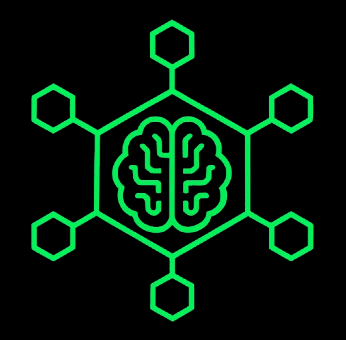
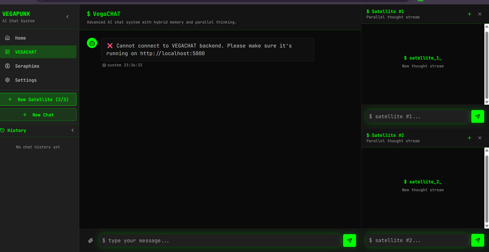
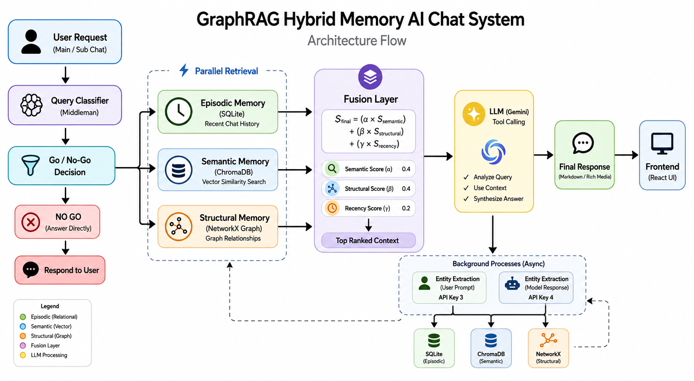

<div align="center">
  

  # VEGAPUNK
  ### Advanced Hybrid Memory AI Chat System

  *Beyond Traditional RAG — Human-like recall through a three-pillar memory architecture*

  
  
  
  
  
</div>

<br clear="left"/>

---

## 📸 Preview

<div align="center">
  
  <p><em>VEGAPUNK Main Chat Interface</em></p>
</div>

---

## 🧠 What is VEGAPUNK?

**VEGAPUNK** is a sophisticated, full-stack AI chat application engineered to simulate human-like recall and deep context understanding. It is powered by the **Google `gemini-2.0-flash-exp`** Large Language Model — but the LLM is merely the engine. The true innovation lies in its **Hybrid Memory Architecture**.

Rather than relying on a single retrieval strategy, VEGAPUNK fuses three distinct memory systems into a unified context understanding pipeline — solving the core weaknesses of pure vector-based RAG.

> **Why "Beyond RAG"?** Pure semantic search fails at logical leaps, temporal relevance, and structural context. VEGAPUNK solves all three.

---

## ✨ Key Features

- 🔀 **Hybrid Memory Fusion** — Three memory pillars ranked by a custom scoring algorithm
- 🧩 **Graph RAG** — NetworkX knowledge graph for multi-hop logical inference
- ⏱️ **Recency Decay** — Prevents old context from drowning out new instructions
- 🖼️ **Multimodal Input** — Native vision support via Gemini's unified API
- 💬 **Sub Chat (Satellite) Mode** — Isolated debugging sessions that don't pollute main memory
- ⚡ **Parallel Retrieval** — ThreadPoolExecutor cuts retrieval latency from ~1200ms to ~400ms
- 🔑 **Distributed API Key Management** — 4-key load balancing to avoid rate limits

---

## 🏗️ System Architecture

<div align="center">
  
  <p><em>Full Architecture — Lifecycle of a Request through VEGAPUNK's Hybrid Memory System</em></p>
</div>

The system is an inherently **client-server** architecture:

| Layer | Technology |
|---|---|
| **Frontend** | React 18, Vite, TypeScript, Tailwind CSS, shadcn/ui |
| **Backend** | Python Flask REST API |
| **LLM** | Google Gemini 2.0 Flash (Tool Calling) |
| **Episodic Memory** | SQLite (`vegapunk_memory.db`) |
| **Semantic Memory** | ChromaDB + HuggingFace `all-MiniLM-L6-v2` |
| **Structural Memory** | NetworkX Knowledge Graph + SQLite persistence |

---

## 🧱 The Three Pillars of Hybrid Memory

### 🗂️ 1. Episodic Memory — Relational SQLite
Acts as the system's **short-term and explicit historical memory**. Records the exact conversational flow: sessions, raw message text, and timestamps. When the agent needs to know exactly what was said 3 messages ago, it queries Episodic Memory — providing the strict temporal timeline that semantic searches often scramble.

### 🔍 2. Semantic Memory — ChromaDB Vector Store
Provides **"fuzzy" conceptual matching**. Every message is embedded using `sentence-transformers/all-MiniLM-L6-v2`. If a user asks about "browser rendering issues," it can retrieve past conversations about "DOM repaints" or "CSS layout thrashing" — even if those exact keywords were never used.

### 🕸️ 3. Structural Memory — NetworkX Knowledge Graph
Introduces true **Graph RAG**. The system continuously extracts entities from messages and structures knowledge into weighted relationship edges:

| Relationship | Weight |
|---|---|
| `CAUSES` | 1.0 |
| `CONTAINS` | 0.9 |
| `MENTIONS` | 0.8 |
| `RELATED_TO` | 0.7 |
| `PART_OF` | 0.6 |
| `DERIVED_FROM` | 0.5 |
| `ALIAS_OF` | 0.4 |

This allows multi-hop path traversal that a pure vector similarity search would miss entirely.

---

## 🔮 The Fusion Layer — The Secret Sauce

The **Fusion Layer** (`backend/fusion_layer.py`) is the mathematical arbiter between all three memory pillars. For every candidate context chunk, it calculates a final relevance score:

$$S_{final} = (\alpha \times S_{semantic}) + (\beta \times S_{structural}) + (\gamma \times S_{recency})$$

### Default Weights (`FusionConfig`)

| Parameter | Value | Purpose |
|---|---|---|
| **α (Alpha)** | `0.4` | Semantic similarity from ChromaDB |
| **β (Beta)** | `0.4` | Structural graph importance (PageRank + edge weights) |
| **γ (Gamma)** | `0.2` | Recency — tie-breaker, prevents locking onto old paradigms |

### Recency Decay
Information older than **one week (168 hours)** decays to a `min_score` threshold (`0.1`), ensuring it is only surfaced if its semantic or structural scores are overwhelmingly high:

```python
age_hours = (now - timestamp).total_seconds() / 3600
decay = age_hours / cfg.recency_decay_hours  # Default: 168 hours
recency_score = max(cfg.recency_min_score, 1.0 - decay)
```

---

## ⚡ Lifecycle of a Request

```
User sends message
       │
       ▼
  [1] Ingestion & Parsing
       Strip  tags → extract base64 for vision pipeline
       │
       ▼
  [2] Classification (Key 2)
       Lightweight LLM → RECENT_CHAT / TOPIC_SEARCH / GENERAL_KNOWLEDGE
       │
       ▼
  [3] Main LLM (Key 1) + Tool Decision
       Can I answer directly? → Yes → Synthesize
       No → Issue function call to _hybrid_search_tool
       │
       ▼
  [4] Parallel Retrieval (ThreadPoolExecutor × 3 threads)
       ├── SQLite Episodic Search
       ├── ChromaDB Semantic Search
       └── NetworkX Graph RAG Search
       │
       ▼
  [5] Fusion Layer
       Rank & fuse all results → Top 10 context chunks
       │
       ▼
  [6] Synthesis
       LLM generates final answer using curated context
       │
       ▼
  [7] Background Spawn (Keys 3 & 4)
       Entity extraction → Update ChromaDB + NetworkX (async)
       │
       ▼
  Response rendered in MainChat.tsx (Markdown)
```

---

## 🖥️ Frontend Components

### Main Chat (`MainChat.tsx`)
The primary interface. Every message is processed by all three memory systems, building the long-term context. Messages are considered **"canon"** for the project's memory timeline.

### Sub Chat — Satellite Mode (`SubChat.tsx`)
A critical feature for debugging and tangential exploration. Sub Chats **inherit** the main session context but **do not write** to memory (`save_to_memory=False`). This prevents chaotic debugging logs, massive error dumps, or exploratory rabbit holes from permanently polluting the knowledge graph.

> *Ask "stupid questions" freely — they won't corrupt your main project memory.*

### Markdown & Vision (`ChatMessage.tsx`)
Rendered with `remark-gfm` (tables, code blocks). Images pasted by the user are embedded as base64, extracted by the backend, and routed to Gemini's vision pipeline — all within the same API call.

---

## 🔑 API Key Architecture

VEGAPUNK requires **4 distinct Gemini API keys** for distributed load balancing:

| Key | Role | Rationale |
|---|---|---|
| `GEMINI_API_KEY_1` | Main response synthesis | Most critical path — must never hit 429 |
| `GEMINI_API_KEY_2` | Query classification | Fast, lightweight calls |
| `GEMINI_API_KEY_3` | Entity extraction (user messages) | Background, token-intensive |
| `GEMINI_API_KEY_4` | Entity extraction (model responses) | Background, token-intensive |

---

## 🚀 Getting Started

### Prerequisites
- Node.js & npm
- Python 3.10+
- 4× Google Gemini API Keys

### 1. Environment Setup

Create a `.env` file in the backend directory:

```env
GEMINI_API_KEY_1=your_main_key
GEMINI_API_KEY_2=your_classifier_key
GEMINI_API_KEY_3=your_user_entity_key
GEMINI_API_KEY_4=your_model_entity_key
PORT=5000
DEBUG=True
```

### 2. Frontend

```bash
cd <project_root>
npm install
npm run dev
```

### 3. Backend

```bash
cd backend
python -m venv vegapunk
# Windows
.\vegapunk\Scripts\activate
# macOS/Linux
source vegapunk/bin/activate

pip install -r requirements.txt
python app.py
```

---

## 🧩 Design Rationale

**Why Hybrid Memory over pure vector search?**
Pure vector search suffers from "Lost in the Middle" and "Conceptual Drift." If a user says *"Make it a button"*, a vector search might pull a 3-month-old CSS button discussion — completely missing the active IoT device context. The Episodic + Structural layers anchor the LLM to the correct temporal and logical reality.

**Why SQLite over PostgreSQL/MySQL?**
VEGAPUNK is a personal, locally-first AI agent — not a multi-tenant SaaS application. SQLite requires zero external infrastructure, runs in-process, and aligns with rapid local experimentation.

**Why Google Gemini 2.0 Flash?**
A 1M token context window, native multimodal support, fast time-to-first-token, and — critically — **highly reliable Tool Calling**, which is a strict requirement for the dynamic Hybrid Retrieval routing logic.

---

## 📁 Project Structure

```
vegapunk/
├── Images/
│   ├── Architecture.jpeg
│   ├── Home_page.png
│   └── vegapunk_logo.png
├── src/
│   └── components/
│       ├── MainChat.tsx
│       ├── SubChat.tsx
│       └── ChatMessage.tsx
├── backend/
│   ├── app.py              # Routing & orchestration
│   ├── agent.py            # VegapunkAgent + parallel retrieval
│   ├── fusion_layer.py     # The scoring algorithm (α, β, γ)
│   ├── graph_store.py      # NetworkX knowledge graph
│   ├── vector_store.py     # ChromaDB semantic store
│   ├── database.py         # SQLite episodic memory
│   └── requirements.txt
├── .env
└── README.md
```

---

<div align="center">
  
  <br/>
  <sub>Built with 🧠 — <em>VEGAPUNK: Where Memory Meets Intelligence</em></sub>
</div>
